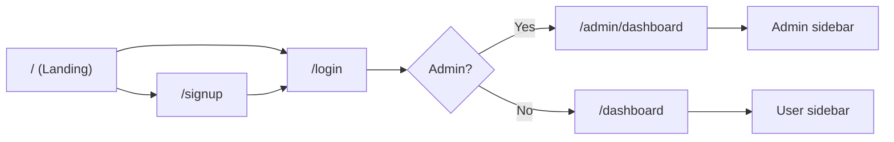
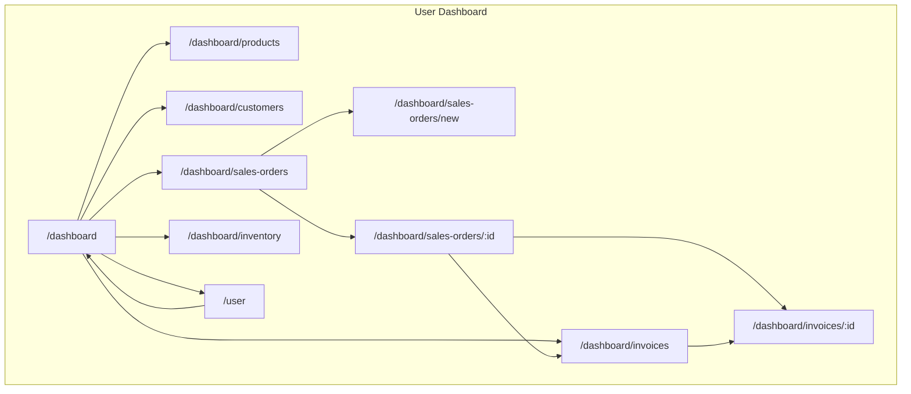
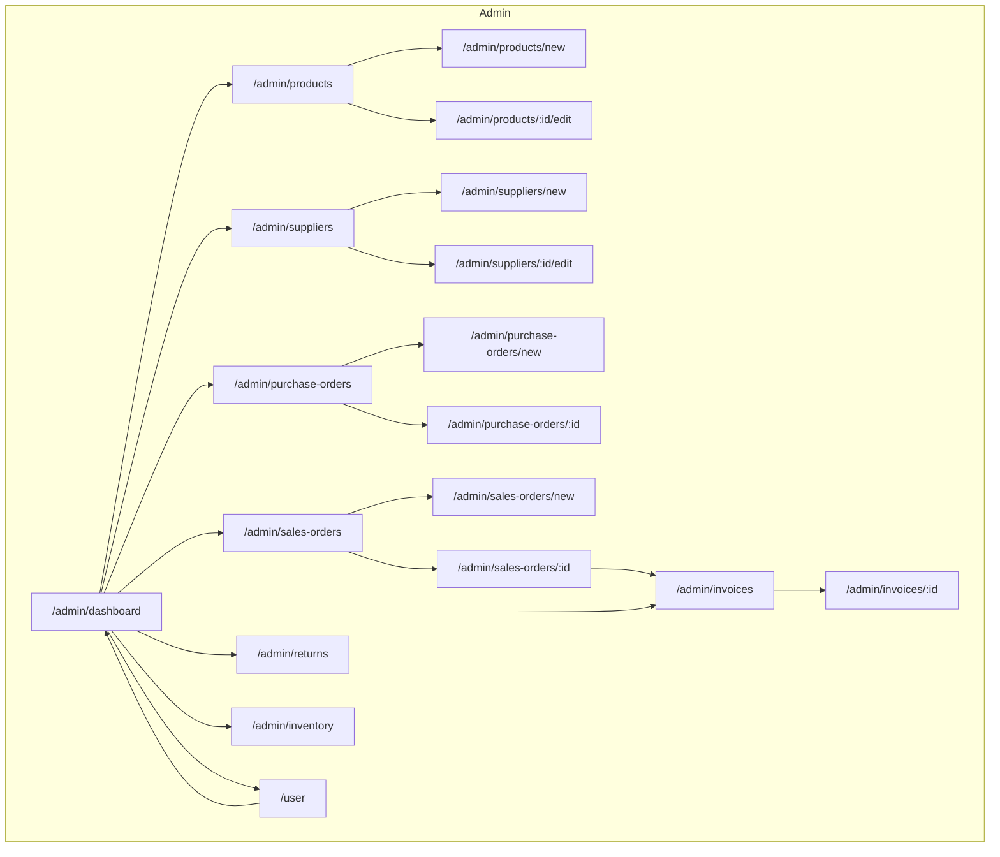
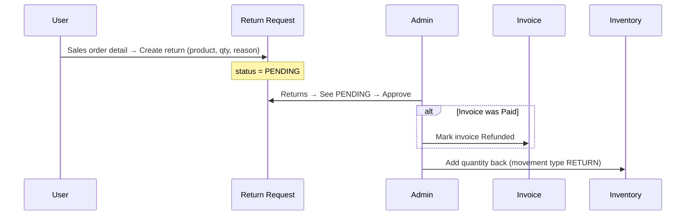
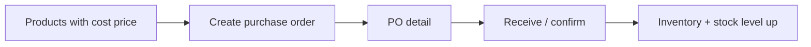
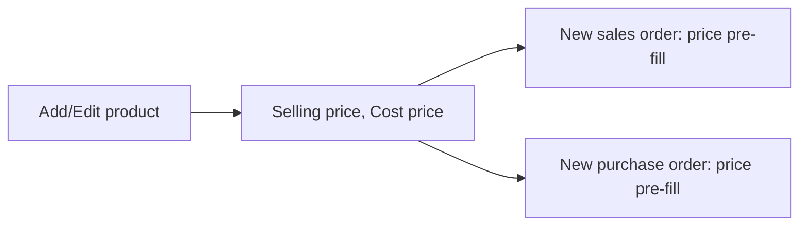
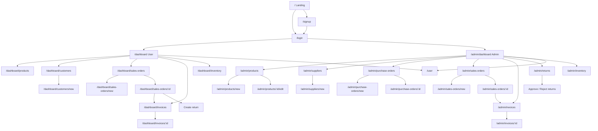

# Inventory Management – Full Flow & Testing Wireframes

Use this document to test all features. It shows how every screen connects and the main business flows.

---

## 1. Entry & auth



| Step | URL | What to test |
|------|-----|---------------|
| 1 | `/` | Landing: Hero, Features, How it works, Dashboard image, Footer, **Login** / **Sign up** / **Create Free Account** |
| 2 | `/signup` | Sign up: Name, Email, Password, Role (**User** / **Admin**), Create account → redirect to login |
| 3 | `/login` | Login with new user → redirect to **/dashboard** (user) or **/admin/dashboard** (admin) |

---

## 2. User app – page map



**User sidebar links (all under `/dashboard` or `/user`):**

| Label | Goes to | What to test |
|-------|--------|---------------|
| Dashboard | `/dashboard` | Stats, quick actions, recent orders, pending deliveries, recent customers |
| Products | `/dashboard/products` | List products (read-only) |
| Customers | `/dashboard/customers` | List + **Add customer** → `/dashboard/customers/new` |
| Sales Orders | `/dashboard/sales-orders` | List orders, **Create** → `/dashboard/sales-orders/new` |
| Sales Order [id] | `/dashboard/sales-orders/[id]` | Detail, **Sell items (fulfill)**, **Generate invoice**, **Returns** section: list + **Create return** |
| Invoices | `/dashboard/invoices` | List invoices |
| Invoice [id] | `/dashboard/invoices/[id]` | Detail, **Record payment**, **Download PDF** |
| Inventory | `/dashboard/inventory` | Stock by product |
| Profile | `/user` | Name, Email, Role(s), Dashboard/Home/Logout |

---

## 3. Admin app – page map



**Admin sidebar links:**

| Label | Goes to | What to test |
|-------|--------|---------------|
| Dashboard | `/admin/dashboard` | Quick actions, stats, charts, recent orders, low stock, payments, expiring |
| Products | `/admin/products` | List, **Add product** → new, **Edit** → `[id]/edit` (name, SKU, category, stock, reorder, **selling price**, **cost price**) |
| Suppliers | `/admin/suppliers` | List, Add, Edit |
| Purchase Orders | `/admin/purchase-orders` | List, **Create** → new (products + cost price pre-fill), detail `[id]` |
| Sales Orders | `/admin/sales-orders` | List, **Create** → new (products + selling price pre-fill), detail `[id]` (fulfill, generate invoice) |
| Invoices | `/admin/invoices` | List, detail `[id]` (pay, PDF) |
| **Returns** | `/admin/returns` | List by status (PENDING / APPROVED / REJECTED), **Approve**, **Reject** |
| Inventory | `/admin/inventory` | Stock, movements, add/deduct, expiry |
| Profile | `/user` | Same as user profile |

---

## 4. Main business flows (for full-path testing)

### Flow A: Sale → Invoice → Payment (User or Admin)

```mermaid
sequenceDiagram
  participant U as User/Admin
  participant SO as Sales Order
  participant INV as Invoice
  participant PAY as Payment

  U->>SO: Create sales order (customer + items; price pre-fill from product)
  U->>SO: Open order detail → Fulfill (sell items)
  Note over SO: Stock deducted
  U->>INV: Generate invoice (from same order)
  U->>INV: Open invoice → Record payment
  Note over PAY: Invoice status → Paid
```

**Steps to test:**

1. **Products have prices:** Admin → Products → Edit a product → set **Selling price** (and Cost price). Save.
2. **Sales order:** Sales Orders → Create → pick Customer, add lines (product → **unit price pre-fills**), save.
3. **Fulfill:** Open that order → **Sell items (fulfill order)**. Confirm. Check Inventory (stock decreased).
4. **Invoice:** Same order page → **Generate invoice**. Go to Invoices → open new invoice.
5. **Payment:** On invoice → **Record payment** (method e.g. Cash). Invoice status → Paid.

---

### Flow B: Return → Approve → Refund + Inventory (User + Admin)



**Steps to test:**

1. **User:** Login as **User** → Sales Orders → open a **fulfilled** order → scroll to **Returns** → **Create return** → pick product, quantity, reason → Submit. See new row with status PENDING.
2. **Admin:** Login as **Admin** → **Returns** (sidebar) → filter PENDING → find the request → **Approve**.
3. **Verify:** Same order’s invoice (if it was Paid) → status should be **Refunded**. Inventory / product stock should increase by the returned quantity.

---

### Flow C: Purchase order & stock (Admin)



**Steps to test:**

1. Set **Cost price** on a product (Admin → Products → Edit).
2. Purchase Orders → Create → pick Supplier, add lines (product → **unit price pre-fills** from cost). Save.
3. Open PO detail → complete receive/confirm flow (if implemented). Check Inventory and product stock level.

---

### Flow D: Product & pricing (Admin)



**Steps to test:**

- Products → New (or Edit) → set **Selling price** and **Cost price**.
- Create Sales Order → select that product → **Unit price** = selling price.
- Create Purchase Order → select that product → **Unit price** = cost price (or selling if no cost).

---

## 5. Quick testing checklist

| # | Area | Action | Route / Where |
|---|------|--------|----------------|
| 1 | Auth | Sign up (User) | `/signup` → Role: User |
| 2 | Auth | Sign up (Admin) | `/signup` → Role: Admin |
| 3 | Auth | Login (user) | `/login` → redirect `/dashboard` |
| 4 | Auth | Login (admin) | `/login` → redirect `/admin/dashboard` |
| 5 | User | View dashboard | `/dashboard` |
| 6 | User | Add customer | Dashboard → Customers → Add customer |
| 7 | User | Create sales order | Sales Orders → Create (customer + items) |
| 8 | User | Fulfill order | Sales order detail → Sell items (fulfill) |
| 9 | User | Generate invoice | Same order → Generate invoice |
| 10 | User | Record payment | Invoices → open invoice → Record payment |
| 11 | User | Create return | Sales order detail (fulfilled) → Returns → Create return |
| 12 | User | View invoices / PDF | Invoices → open → Download PDF |
| 13 | Admin | Add product (with prices) | Products → Add product (selling + cost) |
| 14 | Admin | Edit product prices | Products → Edit → Selling price, Cost price |
| 15 | Admin | Create purchase order | Purchase Orders → Create (supplier + items, cost pre-fill) |
| 16 | Admin | Create sales order | Sales Orders → Create (items, selling price pre-fill) |
| 17 | Admin | Fulfill & invoice | Sales order detail → Fulfill → Generate invoice |
| 18 | Admin | Approve return | Returns → PENDING → Approve (check Refund + stock) |
| 19 | Admin | Reject return | Returns → PENDING → Reject |
| 20 | Admin | Inventory adjust | Inventory → add/deduct (if UI exists) |
| 21 | Both | Profile & role | `/user` → see Name, Email, Role |
| 22 | Both | Logout (navbar/sidebar) | Logout → back to `/login` |

---

## 6. How screens connect (one diagram)



Use this file as your map: follow the flows above and tick off the checklist to test all features end-to-end.
